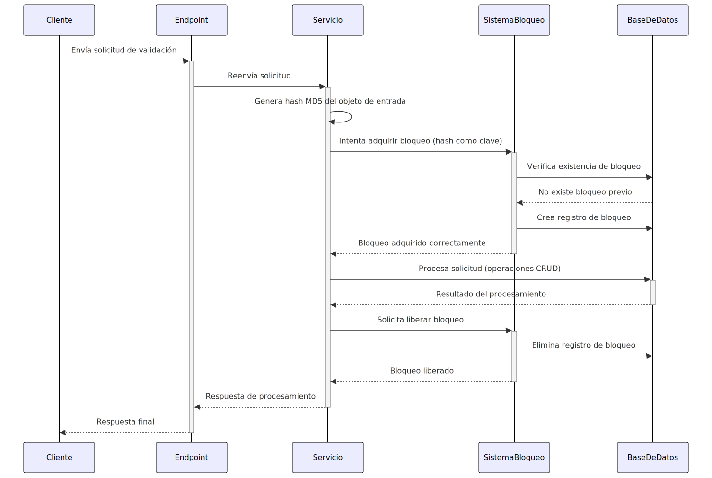
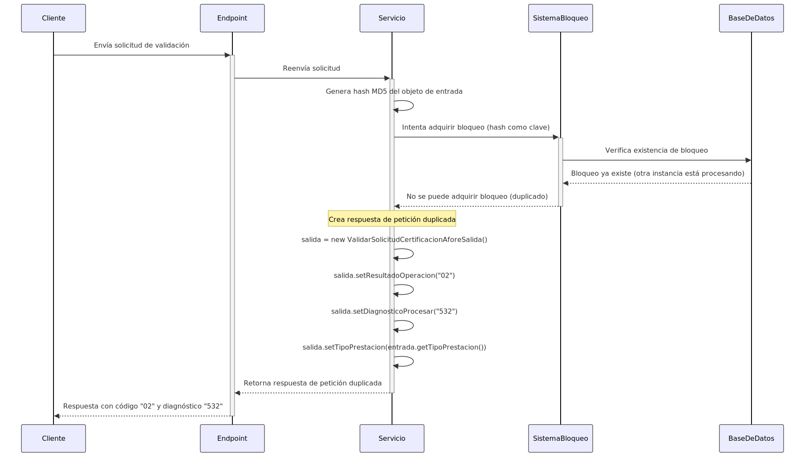
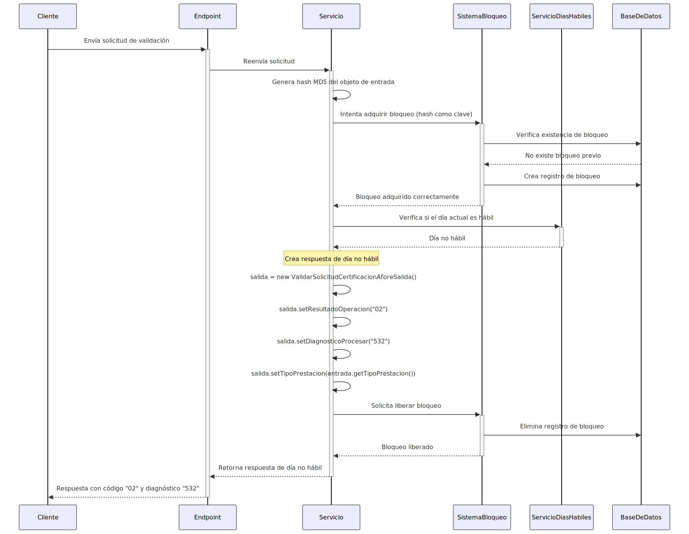

# Documentación del Servicio REST de Validación de Solicitudes de Certificación AFORE

## Tabla de Contenido

1. [Introducción](#introduccion)
2. [Arquitectura del Servicio](#arquitectura-del-servicio)
3. [Servicio REST de Validación](#servicio-rest-de-validacion)
4. [Sistema de Control de Concurrencia](#sistema-de-control-de-concurrencia)
5. [Comparativa de Implementación](#comparativa-de-implementacion)
6. [Configuración](#configuracion)
7. [Escenarios de Uso](#escenarios-de-uso)
8. [Consideraciones Técnicas](#consideraciones-tecnicas)

## Introduccion

Este documento describe el servicio REST de validación de solicitudes de certificación AFORE y su implementación para el manejo de concurrencia. El servicio está diseñado para operar en un entorno con múltiples instancias, garantizando que las peticiones duplicadas sean detectadas y manejadas adecuadamente.

La implementación utiliza un sistema de bloqueo distribuido basado en base de datos que permite coordinar el acceso a recursos compartidos entre múltiples instancias del servicio, evitando condiciones de carrera y procesamiento duplicado.

## Arquitectura del Servicio

El servicio está implementado como un controlador REST en Spring Boot que recibe solicitudes de validación de certificación AFORE. La arquitectura incluye:

- **Controlador REST**: Punto de entrada para las solicitudes HTTP.
- **Servicios de Negocio**: Implementan la lógica de validación de solicitudes.
- **Sistema de Control de Concurrencia**: Garantiza que peticiones idénticas no se procesen simultáneamente.
- **Capa de Persistencia**: Almacena información de bloqueos distribuidos.

## Servicio REST de Validacion

### Contrato de Entrada/Salida

El servicio mantiene el mismo contrato de entrada y salida para garantizar compatibilidad con los sistemas existentes:

- **Entrada**: `ValidarSolicitudCertificacionAforeEntrada`
- **Salida**: `ValidarSolicitudCertificacionAforeSalida`

### Endpoint y Método

```java
@ResponseBody
@PostMapping(value = "disposicionimss/certificacion", 
             produces = { MediaType.APPLICATION_JSON_VALUE }, 
             consumes = { MediaType.APPLICATION_JSON_VALUE })
public ValidarSolicitudCertificacionAforeSalida validarSolicitudCertificacionAfore(
        @RequestBody ValidarSolicitudCertificacionAforeEntrada entrada)
```

## Sistema de Control de Concurrencia

### Componentes del Sistema

El sistema de control de concurrencia está compuesto por los siguientes componentes:

1. **DistributedLock**: Entidad JPA que representa un bloqueo en la base de datos.
2. **DistributedLockRepository**: Repositorio JPA para operaciones CRUD con bloqueos.
3. **LockManagerService**: Servicio de bajo nivel para gestionar bloqueos.
4. **ConcurrencyService**: Servicio de alto nivel que proporciona una API simplificada.

### Modelo de Datos

La entidad `DistributedLock` almacena la información de los bloqueos:

```java
@Entity
@Table(name = "TB_NSAR_BLOQUEO_DISTRIBUIDO", indexes = {
    @Index(name = "IDX_LLAVE_BLOQUEO", columnList = "CH_LLAVE_BLOQUEO", unique = true),
    @Index(name = "IDX_FECHA_EXPIRACION", columnList = "FC_EXPIRA_BLOQUEO") })
public class DistributedLock {
    @Id
    @Column(name = "ID_BLOQUEO_DISTRIBUIDO")
    @GeneratedValue(strategy = GenerationType.SEQUENCE, generator = "bloqueoSequence")
    @SequenceGenerator(name = "bloqueoSequence", sequenceName = "SEQ_TB_NSAR_BLOQUEO_DISTRIBUIDO", allocationSize = 1)
    private Long idBloqueoDistribuido;
    
    @Column(name = "CH_LLAVE_BLOQUEO", length = 255, nullable = false, unique = true)
    private String llaveBloqueo;
    
    @Column(name = "CH_PROCESO_BLOQUEO", length = 100, nullable = false)
    private String procesoBloqueo;
    
    @Temporal(TemporalType.TIMESTAMP)
    @Column(name = "FC_INICIO_BLOQUEO", nullable = false)
    private Date fechaInicioBloqueo;
    
    @Temporal(TemporalType.TIMESTAMP)
    @Column(name = "FC_EXPIRA_BLOQUEO", nullable = false)
    private Date fechaExpiraBloqueo;
    
    @Column(name = "CH_USUARIO_MODIFICADOR", length = 50)
    private String usuarioModificador;
    
    @Column(name = "CH_NOMBRE_SERVICIO", length = 100)
    private String nombreServicio;
    
    // Getters y setters omitidos por brevedad
}
```

### Servicios de Gestión de Concurrencia

#### LockManagerService

Este servicio proporciona operaciones básicas para gestionar bloqueos distribuidos en un entorno distribuido, utilizando una base de datos como mecanismo de coordinación:

- **acquireLock**: Intenta adquirir un bloqueo para un recurso específico utilizando un algoritmo de tres pasos.
- **releaseLock**: Libera un bloqueo previamente adquirido, verificando el propietario del bloqueo.
- **cleanupExpiredLocks**: Tarea programada que elimina periódicamente los bloqueos expirados para mantener la integridad del sistema.

```java
/**
 * Intenta adquirir un bloqueo distribuido para un recurso específico.
 * 
 * Este método implementa un algoritmo de tres pasos para adquirir un bloqueo:
 * 1. Verifica si ya existe un bloqueo válido para el recurso
 * 2. Si no existe, intenta crear un nuevo bloqueo
 * 3. Verifica que el bloqueo fue adquirido correctamente
 * 
 * @param resourceId Identificador único del recurso a bloquear
 * @param processId Identificador único del proceso que solicita el bloqueo
 * @return true si el bloqueo fue adquirido exitosamente, false en caso contrario
 */
@Transactional(isolation = Isolation.SERIALIZABLE)
public boolean acquireLock(String resourceId, String processId) {
    try {
        // Obtener la fecha actual para cálculos de expiración
        Date now = new Date();
        // Calcular la fecha de expiración del bloqueo
        Date expiryTime = new Date(now.getTime() + (lockTimeoutSeconds * 1000));
        
        // Paso 1: Verificar si ya existe un bloqueo válido para este recurso
        Optional<DistributedLock> existingLock = lockRepository.findValidLock(resourceId, now);
        
        // Si ya existe un bloqueo válido, verificar si pertenece a este proceso
        if (existingLock.isPresent()) {
            return existingLock.get().getProcesoBloqueo().equals(processId);
        }
        
        // Paso 2: Intentar crear un nuevo bloqueo
        DistributedLock lock = new DistributedLock();
        lock.setLlaveBloqueo(resourceId);
        lock.setProcesoBloqueo(processId);
        lock.setFechaInicioBloqueo(now);
        lock.setFechaExpiraBloqueo(expiryTime);
        lock.setUsuarioModificador(defaultUser);
        lock.setNombreServicio(serviceName);
        
        lockRepository.save(lock);
        
        // Paso 3: Verificar que el bloqueo fue adquirido correctamente
        Optional<DistributedLock> acquiredLock = lockRepository.findValidLock(resourceId, now);
        return acquiredLock.isPresent() && acquiredLock.get().getProcesoBloqueo().equals(processId);
    } catch (Exception e) {
        logger.error("Error al intentar adquirir bloqueo para el recurso: " + resourceId, e);
        return false;
    }
}
```

#### ConcurrencyService

Este servicio proporciona una API de alto nivel para ejecutar operaciones con control de concurrencia, abstrayendo la complejidad del manejo de bloqueos:

- **executeWithLock**: Ejecuta una acción con bloqueo distribuido, gestionando automáticamente la adquisición y liberación del bloqueo.
- **isResourceLocked**: Verifica si un recurso está actualmente bloqueado sin intentar adquirir el bloqueo.

```java
/**
 * Ejecuta una acción con protección de bloqueo distribuido.
 * 
 * Este método intenta adquirir un bloqueo para el recurso especificado,
 * ejecuta la acción proporcionada si el bloqueo se adquiere con éxito,
 * y finalmente libera el bloqueo independientemente del resultado.
 * 
 * @param resourceId Identificador único del recurso a bloquear
 * @param action Acción a ejecutar si el bloqueo se adquiere con éxito
 * @param <T> Tipo de retorno de la acción
 * @return Resultado de la acción o null si no se pudo adquirir el bloqueo
 * @throws Exception Si ocurre un error durante la ejecución de la acción
 */
public <T> T executeWithLock(String resourceId, Supplier<T> action) throws Exception {
    String processId = UUID.randomUUID().toString();
    boolean lockAcquired = false;
    
    try {
        // Intentar adquirir el bloqueo con reintentos
        for (int attempt = 0; attempt < maxRetries; attempt++) {
            lockAcquired = lockManagerService.acquireLock(resourceId, processId);
            
            if (lockAcquired) {
                break;
            }
            
            // Si no se pudo adquirir el bloqueo, esperar antes de reintentar
            if (attempt < maxRetries - 1) {
                Thread.sleep(retryDelayMillis);
            }
        }
        
        // Si se adquirió el bloqueo, ejecutar la acción
        if (lockAcquired) {
            return action.get();
        } else {
            logger.warn("No se pudo adquirir el bloqueo para el recurso: " + resourceId);
            return null;
        }
    } finally {
        // Liberar el bloqueo si fue adquirido
        if (lockAcquired) {
            lockManagerService.releaseLock(resourceId, processId);
        }
    }
}
```

## Comparativa de Implementacion

Esta sección muestra la evolución del método principal del servicio REST, destacando cómo se ha implementado el control de concurrencia manteniendo el mismo contrato de entrada/salida.

### Implementación Original

La implementación original del método no incluía mecanismos para el control de peticiones duplicadas:

```java
/**
 * Método que valida una solicitud de certificación AFORE.
 * 
 * Este método procesa la solicitud de certificación verificando primero si es día hábil
 * y luego delegando la validación al servicio correspondiente. No incluye mecanismos
 * para prevenir el procesamiento duplicado de solicitudes idénticas.
 * 
 * @param entrada Objeto con los datos de la solicitud a validar
 * @return Objeto con el resultado de la validación
 */
@ResponseBody
@PostMapping(value = "disposicionimss/certificacion", produces = {MediaType.APPLICATION_JSON_VALUE}, consumes = {MediaType.APPLICATION_JSON_VALUE})  
public ValidarSolicitudCertificacionAforeSalida validarSolicitudCertificacionAfore(@RequestBody ValidarSolicitudCertificacionAforeEntrada entrada){
  logger.info("ENtrada validarSolicitudCertificacionAfore: {}", entrada);
  ValidarSolicitudCertificacionAforeSalida salida;
  
  try {
    // Verificar si es día hábil para procesar la solicitud
    String validarDiaHabil = validarDiasHabilService.obtenerDiaHabil(LocalDate.now(), "P00020");
    if ("1".equals(validarDiaHabil)) {
        // Procesar la solicitud si es día hábil
        salida = validarSolicitudCertificacionAforeService.validarSolicitudCertificacionAfore(entrada);
        // Enviar notificación del resultado
        notificacionesService.notificarServicioAfore(entrada, salida);
    }else {
        // Rechazar la solicitud si no es día hábil
        salida = new ValidarSolicitudCertificacionAforeSalida();
        salida.setResultadoOperacion("02");
        salida.setDiagnosticoProcesar("532");
        salida.setTipoPrestacion(entrada.getTipoPrestacion());
    }        
  }catch (Exception e) {
    // Manejar cualquier excepción durante el procesamiento
    logger.error("error en la aplicacion", e);
    salida = new ValidarSolicitudCertificacionAforeSalida();
    salida.setResultadoOperacion("02");
    salida.setDiagnosticoProcesar("999");
    salida.setTipoPrestacion(entrada.getTipoPrestacion());
  }
  return salida;
}
```

### Implementación con Control de Concurrencia

La nueva implementación incorpora el mecanismo de bloqueo distribuido para evitar el procesamiento de peticiones duplicadas:

```java
/**
 * Método que valida una solicitud de certificación AFORE con control de concurrencia.
 * 
 * Este método implementa un mecanismo de detección y prevención de procesamiento
 * de peticiones duplicadas utilizando un sistema de bloqueo distribuido. El proceso es:
 * 
 * 1. Genera un hash único basado en el contenido de la petición
 * 2. Intenta adquirir un bloqueo distribuido utilizando ese hash como identificador
 * 3. Si el bloqueo no puede ser adquirido, significa que una petición idéntica
 *    está siendo procesada por otra instancia, y se retorna un código específico
 * 4. Si el bloqueo es adquirido, se procesa la petición normalmente
 * 5. Al finalizar, se libera el bloqueo para permitir el procesamiento de futuras peticiones
 * 
 * @param entrada Objeto con los datos de la solicitud a validar
 * @return Objeto con el resultado de la validación
 */
@ResponseBody
@PostMapping(value = "disposicionimss/certificacion", produces = { MediaType.APPLICATION_JSON_VALUE }, consumes = {
        MediaType.APPLICATION_JSON_VALUE })
public ValidarSolicitudCertificacionAforeSalida validarSolicitudCertificacionAfore(
        @RequestBody ValidarSolicitudCertificacionAforeEntrada entrada) {

    logger.info("Entrada validarSolicitudCertificacionAfore: {}", entrada);

    ValidarSolicitudCertificacionAforeSalida salida;
    String peticionKey = null;
    String processId = null;
    boolean lockAcquired = false;

    try {
        // Generar hash del objeto de entrada para detectar peticiones idénticas
        try {
            // Convertir el objeto de entrada a JSON para generar un hash consistente
            String jsonContent = objectMapper.writeValueAsString(entrada);
            // Generar un hash MD5 del contenido JSON
            String hashContent = DigestUtils.md5Hex(jsonContent);
            
            // Crear una clave única para esta petición combinando un prefijo con el hash
            peticionKey = StringUtils.join(PREFIJO_CERTIFICACION, hashContent);
            // Generar un ID de proceso único para esta instancia específica
            processId = UUID.randomUUID().toString();

            // Intentar adquirir el bloqueo para esta petición específica
            lockAcquired = lockManagerService.acquireLock(peticionKey, processId);

            if (!lockAcquired) {
                // Si no se pudo adquirir el bloqueo, significa que una petición idéntica está
                // siendo procesada por otra instancia del servicio
                salida = new ValidarSolicitudCertificacionAforeSalida();
                salida.setResultadoOperacion("02");
                salida.setDiagnosticoProcesar("532");
                salida.setTipoPrestacion(entrada.getTipoPrestacion());
                return salida;
            }
        } catch (JsonProcessingException e) {
            // Si falla la generación del hash, registramos el error pero continuamos
            // con el procesamiento normal (sin protección de concurrencia)
            logger.error("Error al procesar JSON para validación de duplicados", e);
            // Continuamos con el proceso normal si falla la detección de duplicados
        }

        // Lógica original del método - Verificar si es día hábil
        String validarDiaHabil = validarDiasHabilService.obtenerDiaHabil(LocalDate.now(), "P00020");
        if ("1".equals(validarDiaHabil)) {
            // Procesar la solicitud si es día hábil
            salida = validarSolicitudCertificacionAforeService.validarSolicitudCertificacionAfore(entrada);
            notificacionesService.notificarServicioAfore(entrada, salida);
        } else {
            // Rechazar la solicitud si no es día hábil
            salida = new ValidarSolicitudCertificacionAforeSalida();
            salida.setResultadoOperacion("02");
            salida.setDiagnosticoProcesar("532");
            salida.setTipoPrestacion(entrada.getTipoPrestacion());
        }
    } catch (Exception e) {
        // Manejar cualquier excepción durante el procesamiento
        logger.error("error en la aplicación", e);
        salida = new ValidarSolicitudCertificacionAforeSalida();
        salida.setResultadoOperacion("02");
        salida.setDiagnosticoProcesar("999");
        salida.setTipoPrestacion(entrada.getTipoPrestacion());
    } finally {
        // Liberar el bloqueo si fue adquirido, independientemente del resultado
        if (lockAcquired && peticionKey != null && processId != null) {
            try {
                lockManagerService.releaseLock(peticionKey, processId);
            } catch (Exception e) {
                logger.error("Error al liberar bloqueo", e);
            }
        }
    }

    return salida;
}
```

#### Principales Diferencias

1. **Detección de Duplicados**: La nueva implementación genera un hash MD5 del objeto de entrada para identificar peticiones idénticas.

2. **Adquisición de Bloqueo**: Utiliza el servicio `lockManagerService` para adquirir un bloqueo distribuido basado en el hash de la petición.

3. **Manejo de Concurrencia**: Si el bloqueo no puede ser adquirido (porque otra instancia está procesando la misma petición), retorna inmediatamente con un código específico.

4. **Liberación de Recursos**: Incluye un bloque `finally` para garantizar que los bloqueos adquiridos sean liberados, incluso en caso de error.

5. **Mantenimiento del Contrato**: A pesar de los cambios internos, el contrato de entrada/salida se mantiene exactamente igual, asegurando compatibilidad con los sistemas existentes.

## Configuracion

La configuración del sistema de bloqueo distribuido se realiza a través del archivo `application.properties`:

```properties
# Configuración de tiempo de expiración de bloqueos (en segundos)
lock.timeout.seconds=30

# Configuración de reintentos para adquisición de bloqueos
lock.retry.max=3
lock.retry.delay.ms=500

# Configuración de limpieza de bloqueos expirados
lock.cleanup.enabled=true
lock.cleanup.interval.seconds=300

# Nombre del servicio (usado para identificar qué servicio/aplicación creó el bloqueo)
application.service.name=CERT_AFORE

# Usuario por defecto para operaciones de sistema
application.user.default=SYSTEM

# Configuración específica para transacciones
spring.jpa.properties.hibernate.isolation=SERIALIZABLE
```

## Escenarios de Uso

### Escenario 1: Petición Única



### Escenario 2: Peticiones Duplicadas



### Escenario 3: Día No Hábil



## Consideraciones Tecnicas

1. **Transaccionalidad**: Las operaciones de bloqueo utilizan aislamiento SERIALIZABLE para garantizar consistencia.

2. **Expiración de Bloqueos**: Los bloqueos tienen un tiempo de expiración configurable para evitar bloqueos permanentes.

3. **Limpieza Automática**: Una tarea programada elimina periódicamente los bloqueos expirados.

4. **Índices Optimizados**: La tabla de bloqueos incluye índices para mejorar el rendimiento de las consultas.

5. **Manejo de Excepciones**: El sistema maneja adecuadamente las excepciones para garantizar la liberación de recursos.

6. **Compatibilidad**: La implementación mantiene el mismo contrato de entrada/salida para garantizar compatibilidad con los sistemas existentes.
